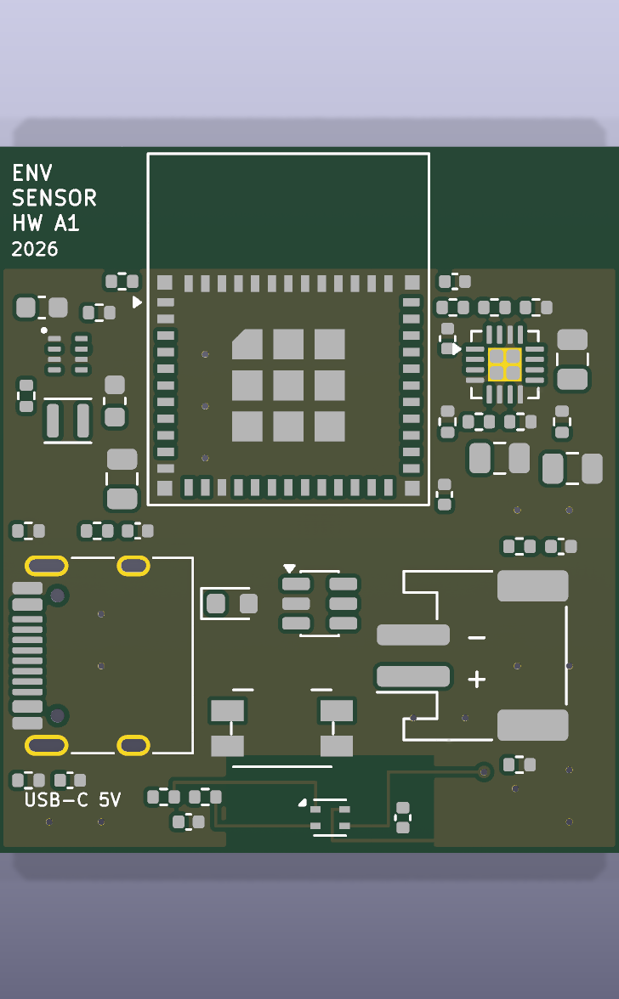
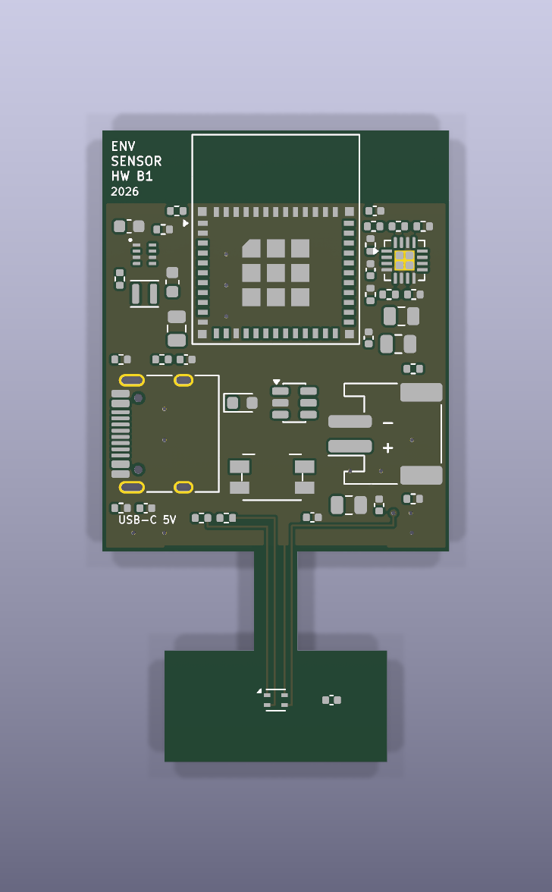
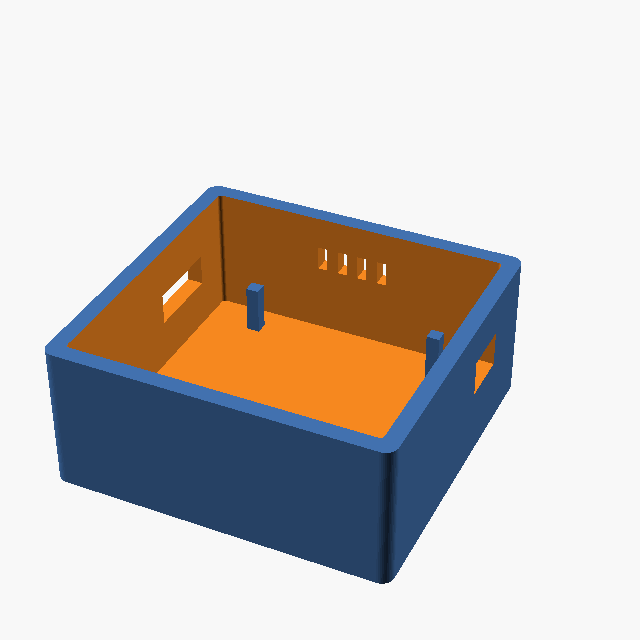
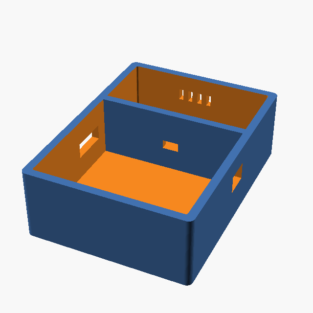

# sensorly-unhinged

A battery-powered indoor temperature and humidity node, developed as **one
electrical platform in two physical implementations** so that the cost of
compactness can be measured instead of guessed.

**Author: Marcel Petrick <mail@marcelpetrick.it>**

**License: GPLv3 or later. See `LICENSE`.**

**Note: project is generated with AI.**

```
                    ESP32-C6-MINI-1 + SHT45-AD1F + BQ24074 + TPS62840
                    1S LiPo · USB-C · deep sleep · BLE provisioning · MQTT/TLS
                                          |
                 +------------------------+------------------------+
                 |                                                 |
         Variant A - Compact                        Variant B - Thermally isolated
         30 × 34 mm, one rectangle                  28 × 51 mm, milled sensor island
         sensor 11.3 mm from the                    on a 3.5 x 8 mm FR-4 neck,
         nearest heat source                        sensor 23.1 mm away, 57x less
                                                    conduction from the electronics
```

| | |
|---|---|
|  |  |
| **A — Compact** (HW A1) | **B — Thermally isolated** (HW B1) |
|  |  |
| 41 × 39 × 20 mm, one chamber | 41 × 56 × 20 mm, two chambers, wall at the neck |

Build 5 of each, put them next to a reference instrument, and let the data pick
the design. The decision gate is written down in
[`docs/50-thermal-ab-test-plan.md`](docs/50-thermal-ab-test-plan.md) *before* the
boards exist, including the thresholds under which A wins.

## Status

Placement- and rule-complete, DRC-clean, **partially routed** — 80 ratsnest
connections per board down to 58; the sensor island, the power fan-out to the
planes and the ground stitching are done, the fine-pitch escapes are not.
Phase 6 of 14 — see [`docs/00-plan.md`](docs/00-plan.md).

```
KiCad ERC      0 violations
KiCad DRC      0 errors, 5 / 4 reviewed warnings on A / B
Sch/PCB parity 0 differences  (both are generated from one model)
Ratsnest       58 of 80 remaining per board (see hardware/drc-budget.json)
Outputs        4-layer gerbers, drill, CPL, assembly PDF, STEP, schematic PDF, BOM
```

[](hardware/outputs/schematic/env-sensor.pdf)

## Build

Everything runs from `make`. If a step cannot, it is not part of the build.

```bash
./localPipeline.sh   # everything below, with a PASS/FAIL summary
```

Or step by step:

```bash
make license   # every authored source carries an SPDX header
make check     # generator rule checks   (Python only, no KiCad needed)
make gen       # regenerate the schematic, both boards, project files, rules, SVGs
make erc       # KiCad ERC on the shared schematic
make drc       # KiCad DRC + schematic/PCB parity gate on both variants
make bom       # BOM + netlist from the shared design model
make thermal   # regenerate the thermal model from the live geometry
make cost      # regenerate the manufacturing estimate from the real design
make mech      # enclosure model + checks + OpenSCAD params (STL if openscad)
make outputs   # gerbers, drill, CPL, assembly PDF, STEP
make render    # KiCad 3D renders
make all
```

Requires KiCad 10 (`kicad-cli`) for everything except `check`.

## How the two boards stay one design

`tools/boardgen/` holds the parts, values, netlist, net classes and design
rules **once**. `variants.py` is the only variant-specific file, and it contains
outline, sensor position and thermal zones — nothing electrical. Both
`.kicad_pcb` files are emitted from that model, so a rule change cannot silently
apply to only one board.

The four sensor-island nets are routed by the generator rather than by hand,
because they carry a rule — 0.15 mm wide, no vias, nothing else near them — and
the same rule is written into each variant's `.kicad_dru`. A number that only
lives in a designer's memory gets widened the first time a route is awkward.

## Documents

| | |
|---|---|
| [`AGENTS.md`](AGENTS.md) | working agreement — read before changing anything |
| [`docs/00-plan.md`](docs/00-plan.md) | 14 phases with gates, schedule, risks, non-goals |
| [`docs/10-requirements.md`](docs/10-requirements.md) | numbered requirements, locked vs open |
| [`docs/20-component-selection.md`](docs/20-component-selection.md) | why SHT45 and not BME280; why C6 and not C3 |
| [`docs/30-electrical-design-spec.md`](docs/30-electrical-design-spec.md) | the circuit, every value traced to a datasheet |
| [`docs/40-floorplans.md`](docs/40-floorplans.md) | A vs B, and what the layout decided |
| [`hardware/outputs/schematic/env-sensor.pdf`](hardware/outputs/schematic/env-sensor.pdf) | the schematic, as built |
| [`docs/45-thermal-model.md`](docs/45-thermal-model.md) | generated screening model |
| [`docs/50-thermal-ab-test-plan.md`](docs/50-thermal-ab-test-plan.md) | the experiment and its decision gate |
| [`docs/60-manufacturing-cost.md`](docs/60-manufacturing-cost.md) | generated cost estimate, from the real joint count |
| [`docs/61-cost-reduction.md`](docs/61-cost-reduction.md) | what would make it cheaper, and what each saving costs |
| [`docs/62-fabrication-3-boards.md`](docs/62-fabrication-3-boards.md) | who makes three boards, and what the antenna needs from them |
| [`docs/70-what-the-board-can-do.md`](docs/70-what-the-board-can-do.md) | what firmware alone unlocks — three radios, one board |
| [`docs/80-enclosure.md`](docs/80-enclosure.md) | generated enclosure model, and the requirements it breaks |
| [`docs/vision.md`](docs/vision.md) | the original transcript this was distilled from |

## Layout

```
docs/            requirements, specs, trade studies, test plans
hardware/
  lib/           project footprint library (vendored + authored, verified)
  variant-a/     HW A1 - compact
  variant-b/     HW B1 - thermally isolated
  outputs/       gerbers, drill, BOM, CPL, STEP  (regenerated by CI)
hardware/schematic/  one generated schematic, shared by both variants
tools/boardgen/  the shared model: design, schematic, geometry, placer, router, checks
mechanical/      OpenSCAD enclosures, generated parameters from the board
firmware/        ESP-IDF application (not started)
```

## Licence

**GPL-3.0-or-later** — see [`LICENSE`](LICENSE). That covers everything authored
here: the generator, the schematic and both boards, the enclosure model, the
documents. Every authored source file carries an SPDX header, the generated
KiCad files carry it in their title block, and `make license` fails the build if
one is missing — a licence that only exists at the repository root stops
travelling the moment a file is copied out.

Two things in the tree are not ours and keep their own terms:

| | |
|---|---|
| `hardware/lib/sensorly.pretty/*` and `hardware/lib/sensorly.kicad_sym` (except the two authored parts) | from the [official KiCad libraries](https://gitlab.com/kicad/libraries), CC-BY-SA 4.0 **with the KiCad library exception** — which explicitly permits unlimited use in your own designs without imposing licence terms on the design itself. See `hardware/lib/README.md`. |
| Datasheet figures quoted in `docs/` | the manufacturers'. Cited, not reproduced. |

The KiCad library exception is what makes this combination clean: the footprints
can sit inside a GPL project without the CC-BY-SA terms propagating to the board.
