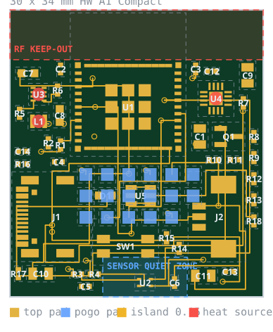
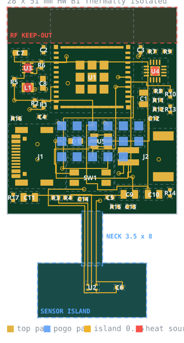

# 40 — Floorplans A and B

Both boards are emitted from one model (`tools/boardgen/`). The parts, values,
netlist, net classes and design rules are identical; `variants.py` is the only
file that differs between them, and it contains outline, sensor position and
thermal zones — nothing electrical.

| |  |  |
|---|---|---|
| | **A — Compact**, HW A1 | **B — Thermally isolated**, HW B1 |

KiCad renders of the same two files: `img/render-a.png`, `img/render-b.png`.

## Side by side

| | **A — Compact** | **B — Thermally isolated** |
|---|---|---|
| PCB | 30 × 34 mm (1020 mm²) | 28 × 51 mm (1310 mm² incl. island) |
| Layers | 4, FR-4, 1.6 mm | identical |
| Parts | 41 placements | identical |
| Sensor position | bottom edge, board centre | on a 18 × 9 mm island |
| Neck | — | 3.5 × 8.0 mm FR-4, 4 × 0.15 mm traces |
| Nearest heat source to the sensor | **11.3 mm** (D1) | **23.1 mm** (J1) |
| Idealized slab / neck conductance (not actual A/B coupling) | **70 mW/K** | **1.2 mW/K** |
| Hypothetical slab / neck ratio | — | **57×**, not a performance claim |
| Assembly difficulty | identical (single-sided SMT, same stencil apertures) | identical |
| Panel area / PCB cost | lower | ~28 % more area |
| Mechanical risk | none | the neck: 3.5 mm of FR-4 carrying an island |
| Enclosure | one chamber, vents at the sensor edge | two chambers with a dividing wall at the neck |

## What the layout actually decided

**The connectors moved to the side edges.** In B the bottom edge is where the
thermal neck leaves the board, and both variants share one placement table — so
the USB-C receptacle sits on the left edge and the JST on the right in *both*.
This is a good example of the shared-model discipline paying off: a decision
forced by B automatically applies to A, and the two boards stay comparable.

**The antenna keep-out costs 170 mm².** Espressif ask for ~15 mm clear around
the module antenna. Neither board is 30 mm wider than the module, so in-plane we
give the antenna the **full width of the board for its whole length** and buy the
rest of the clearance from the enclosure. That is ~17 % of variant A's area
spent on a strip with no copper on any layer. It is also the only place on the
board with room for a silkscreen title block, which is where it now lives.

**There are no mounting holes.** M-04 forbids metal fasteners near the antenna;
a nylon M2 boss costs ~19 mm² on a board this size; and the printed enclosure can
register the board on ribs against the USB-C and JST cut-outs. Revisit at Rev 2
if that retention proves unreliable.

**Reference designators are not on the silkscreen.** Forty 0402s on 30 × 34 mm
cannot be silk-labelled legibly — KiCad's silk DRC said so, 93 times. The
assembly drawing (`F.Fab`/`B.Fab`, exported to `hardware/outputs/*/assembly/`)
carries every reference. The silkscreen carries what a human needs while holding
the board: name, revision, battery polarity, USB and pogo labels.

## Thermal interpretation

`45-thermal-model.md` compares a hypothetical solid slab with B's thin neck.
The slab has a **112×** copper/FR-4 conductance ratio, but A's actual sensor
quiet zone removes pours on every layer. Neither this ratio nor 57× describes
the actual comparison. The experiment must remain capable of choosing A.

## Why B is not obviously right either

1. **The neck is 3.5 mm of FR-4 holding an island.** Bare-board handling, depanel
   and assembly all apply force there. First bare-PCB inspection has to check it
   (open item EDS-8: 3.0 / 3.5 / 5.0 mm).
2. **Both variants depend on their enclosure.** Chamber walls, ribs, vents and
   battery placement create heat paths omitted by the slab calculation.
3. **28 % more board area, a longer enclosure, and a shape that is harder to
   panelise.** Real money at 20 units, and more at 200.
4. The four island traces are the entire electrical path to the sensor and they
   are 0.15 mm wide with no redundancy. An I²C bus that flakes there is a scrap
   board, not a rework.

## Routing status — stated plainly

Both boards are **partially routed**: 80 ratsnest connections per board have
become **58**. What the generator routes, and why:

| | |
|---|---|
| **Sensor island** — 4 nets | They carry a *rule* (0.15 mm, no vias, nothing else near them) that is also written into each `.kicad_dru`, so DRC enforces it against whoever routes the rest. |
| **Power fan-out** — every `+3V0` pad | A routed stub to a via into the In2 plane. Tedious, mechanical, and exactly what a generator should do. |
| **GND** | The F.Cu/B.Cu pours plus a stitching ring; only one connection remains. |
| **Whatever else it could reach** | Variant A: 38 tracks, 364 mm, 27 vias. Variant B: 35 tracks, 487 mm, 18 vias. |

The rest — 58 connections, mostly escapes from the 0.5 mm-pitch charger and the
USB-C receptacle's interleaved D+/D− pairs — is a KiCad session.
`hardware/drc-budget.json` records the 58 and may only ever decrease.

**Why the router stops there.** It has no rip-up and no shoving: once a net is
placed it stays, so a net routed early can permanently block one routed later.
That is a deliberate trade. A better autorouter exists — freerouting, via
Specctra DSN — but its output is a one-off artifact, and this repository's
central claim is that a rule change regenerates *both* boards identically. Route
by hand or by freerouting once, and the next time the neck width moves, someone
has to do it again and hope they make the same decisions twice.

KiCad DRC on both variants: **0 errors, 0 unreviewed warnings, 0 schematic
parity differences.**

## Prior expectation, to be falsified

75 % on B. The number is a prior, not a result. `50-thermal-ab-test-plan.md`
is how we find out, and it is designed to be able to say "A is good enough" —
which, for a room-comfort sensor that spends 99.9 % of its life asleep and cold,
is a real possible answer.
